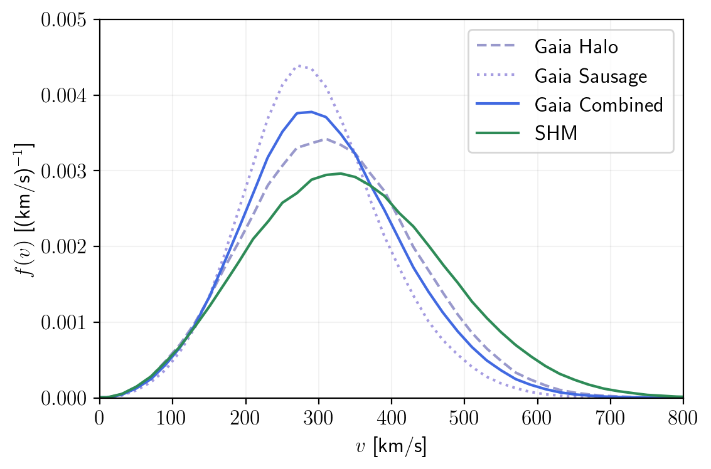

# DD-Gaia-substructure

Project: Effect of the _Gaia_ astrophysics for Dark Matter Direct Detection experiment

Author: <a href="http://inspirehep.net/author/profile/Shing.Chau.Leung.1">John Leung</a>

Date: 2019

## Feature:

By using the dark matter substructure know as the _Gaia_-sausage found by Niceb _et al._, we study the effect of astrophysics uncertainty to the nuclear recoil rate in direct detection experiments. We investigate their effect on upper limits and contours for positive signals on XENON1T experiment. We also, by scaling up XENON1T detector exposure to 200 t yr, forecast a future Gen-3 LXe experiment, which is based on the purposed DARWIN experiment. We investigate the variation of astrophysical effects on different Non-relativistic operators and benchmark relativistic model.

The work is on <a href="https://arxiv.org/abs/1910.xxxxx">1910.xxxxx</a> by Jatan Buch, John Shing Chau Leung, JiJi Fan.

The python notebooks serve as a narration of the forecast technique. The time sequence of the work that leads up to the publication is, in the python files, *dd_eft_substructure-velocity.ipynb* → *dd_eft_substructure-sf-signal-exclusion.ipynb* → *dd_eft_substructure-3D-Signals.ipynb*. The key results are in dd_eft_substructure-3D-Signals.ipynb.

The _Gaia_-sausage compared to the Standard Halo Model (SHM).    

Result for the mass-coupling signal contours.    

Result for the DM mass-mediator mass contours.    

Result for the model-model contours.    

## Acknowledgement:

This script uses the <a href="https://github.com/cweniger/swordfish">Swordfish</a> module by <a href="https://arxiv.org/abs/1712.05401">Edwards and Weniger</a>. Reader can also refer to a closely <a href="https://github.com/tedwards2412/benchmark_free_forecasting/">related work</a> by <a href="https://arxiv.org/abs/1805.04117">Weniger et al.</a>

The <a href="https://linoush.github.io/DM_Velocity_Distribution/">astrophysical model</a> is extracted from <a href="https://arxiv.org/abs/1807.02519">Niceb et al.</a>

The LXe DD detector parameters are taken from the <a href="https://arxiv.org/abs/1705.06655">XENON collaboration</a>. Their latest result at the time of this project is <a href="https://arxiv.org/abs/1805.12562">here</a> (1 ton year result).
